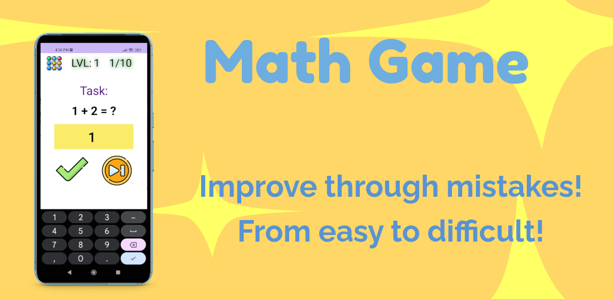
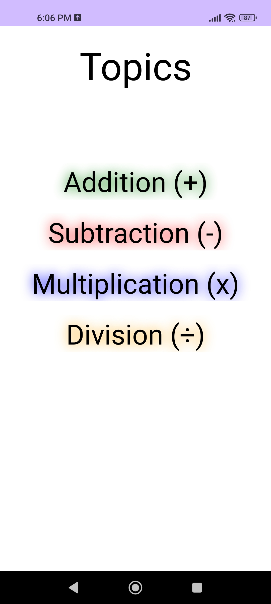
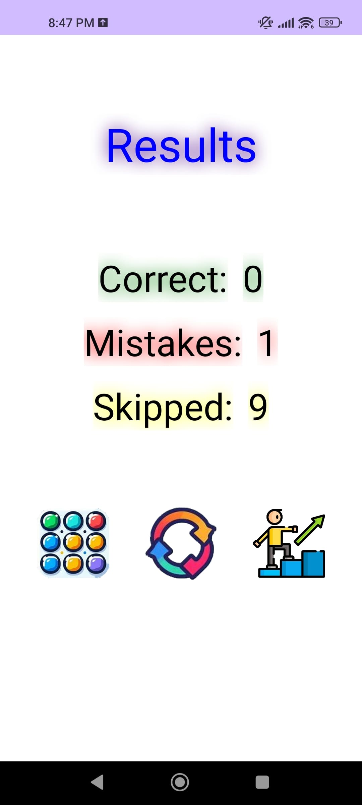
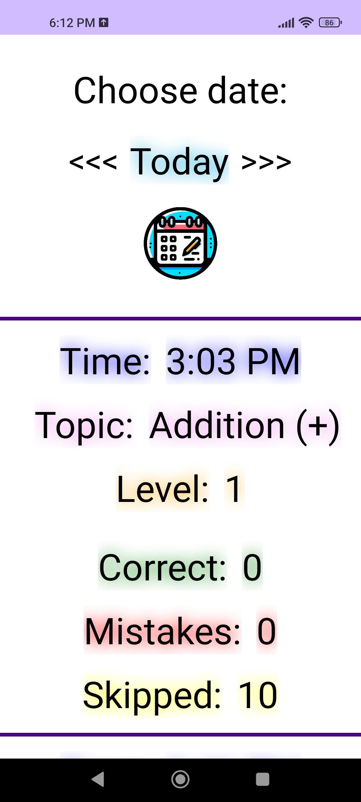
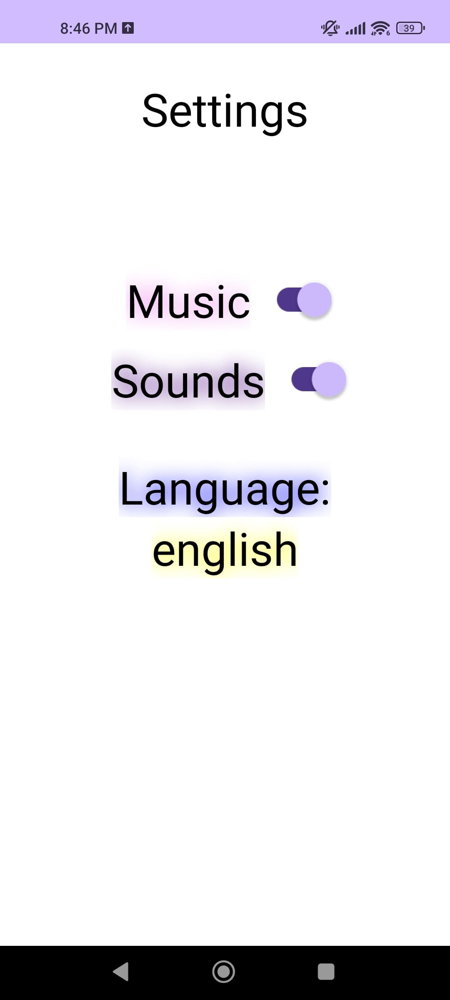

# Math Game - Elementary School Math Skills

   
   
   

Unleash the math whiz within! Master the four basic mathematical operations with MathGame.

Welcome to MathGame, an interactive learning app designed to help students enhance their mathematical skills.

Our app focuses on the four basic mathematical operations: addition, subtraction, multiplication, and division.
Through a series of engaging and challenging math problems, students can practice and improve their math skills right from their Android devices.

Key Features:
  1. New  of each game: our application offers new tasks every time, which make the game enjoyable and unique.
  2. View history: you can view the history of games with their results.
  3. User-friendly interface: The interface is easy to navigate, colorful and engaging.
  4. The game supports two languages: English and Ukrainian.

With MathGame, learning math becomes a fun and rewarding experience. Download our app today and start your journey to becoming a MathGame's Champion!

Tick icons created by Freepik - Flaticon - flaticon.com/free-icons/tick
AI Image Generator - hotpot.ai/art-generator
